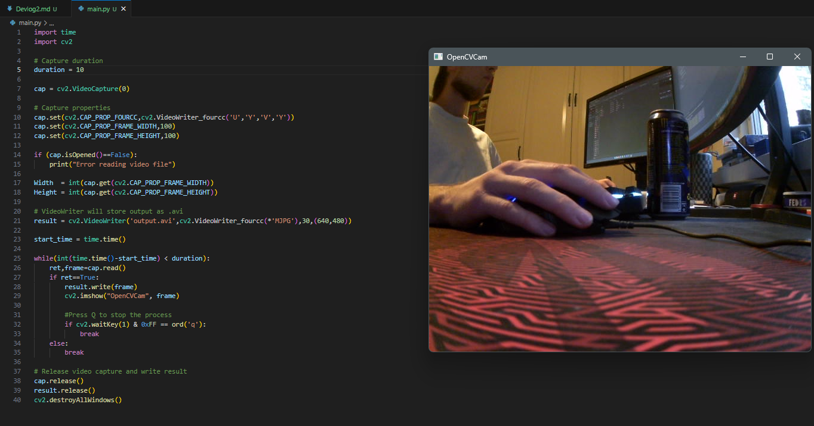

### Date: 19/12/2023

Changed devlog format to markdown to include images, and changed naming scheme from Devlog1 ... to Devlog_1. Devlog_1 will still remain as txt.
 
Got OpenCV working and producing a single video file. Vide file gets rewritten each time the program is ran. 
Changing resolution varibles doesnt seem to do anything.
Video with duration 10s and res: 640x480 30fps = 11MB.
Changing video framerate does not affect file size. 
.mp4 format does not seem to be supported as i get an error on playback: mp4v format is not supported.

Resolution and filesize may be changed with this? 
https://docs.opencv.org/3.4/dc/dfc/group__videoio__flags__others.html

Image from todays working code: 

### ToDo:
1. Change video stream to be running constantly.
2. Get video stream to capture on key press
3. Try to change resolution